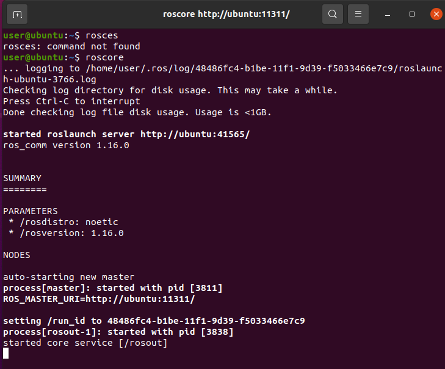
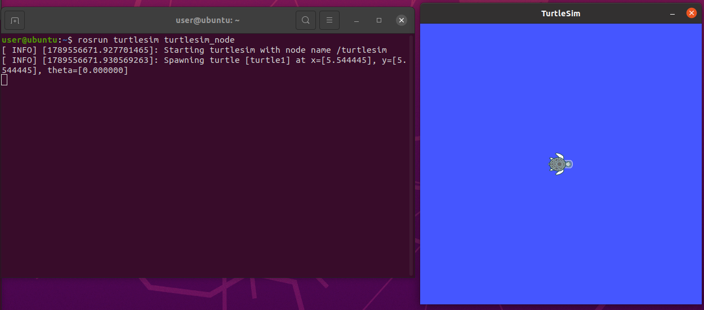
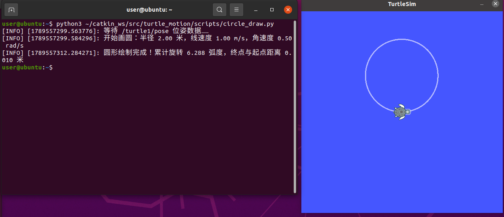

# 小海龟画圆实验

## 一、实验目的与环境说明

### 1.1 实验目的

1. 掌握 ROS 话题通信机制：节点作为发布者向 `/turtle1/cmd_vel` 话题发布 `geometry_msgs/Twist` 速度消息，同时作为订阅者接收 `/turtle1/pose` 话题的 `turtlesim/Pose` 位姿消息；
2. 掌握线速度和角速度的组合控制，理解圆周运动半径与速度的关系；
3. 利用实时位姿反馈累计海龟的转角，当累计转角达到 2π 时自动停止；
4. 通过 turtlesim 仿真器，让小海龟自主绘制一个半径约为 2 m 的完整圆形。

### 1.2 实验环境

| 项目 | 配置 |
| ---- | ---- |
| 操作系统 | Ubuntu 20.04（VMware 虚拟机） |
| ROS 发行版 | ROS Noetic |
| 仿真器 | turtlesim |
| 编程语言 | Python 3（rospy） |
| 功能包 | turtle_motion |

功能包目录结构如下：

```text
turtle_motion/
├── package.xml         # 包清单，声明 rospy、geometry_msgs 和 turtlesim 依赖
├── CMakeLists.txt      # 编译配置，安装 Python 脚本
└── scripts/
    └── circle_draw.py # 主程序：控制小海龟画圆
```

## 二、核心控制原理与算法解析

### 2.1 ROS 话题通信

turtlesim 启动后，小海龟会订阅 `/turtle1/cmd_vel` 话题。本实验编写的 `turtle_circle_node` 向该话题发布 `Twist` 消息，控制小海龟的线速度和角速度。

同时，节点订阅 `/turtle1/pose` 话题，实时获取小海龟的位姿：

- `x`、`y`：小海龟在平面中的坐标；
- `theta`：小海龟的朝向角，取值范围为 [−π, π]。

`Twist` 消息中使用两个分量：

- `linear.x`：前进线速度，单位为 m/s；
- `angular.z`：绕 z 轴旋转的角速度，单位为 rad/s。正值表示逆时针旋转，负值表示顺时针旋转。

控制循环使用 `rospy.Rate(50)` 以 50 Hz 持续发布速度指令，避免超过 0.5 秒没有新速度消息时，turtlesim 看门狗自动将小海龟停下。

### 2.2 圆周运动原理

当小海龟同时具有非零线速度 v 和非零角速度 ω 时，它会沿圆弧运动。圆的半径为：

> **R = |v| / |ω|**

本实验设置：

> **v = 1.0 m/s，ω = 0.5 rad/s**

因此理论圆半径为：

> **R = 1.0 / 0.5 = 2.0 m**

完成一圈需要累计旋转 2π 弧度，理论运动时间为：

> **T = 2π / |ω| = 2π / 0.5 ≈ 12.57 s**

### 2.3 闭环转角累计

如果只让节点按照理论时间运行，实际速度误差会导致圆形不能准确闭合。因此，本实验订阅 `/turtle1/pose`，对相邻两帧位姿的朝向角变化量进行累加。

每个控制周期的角度变化量为：

> **Δθ = θ_current − θ_previous**

由于 `theta` 的取值范围为 [−π, π]，当角度跨越 π 或 −π 时会出现数值跳变。程序使用 `normalize_angle()` 将每次角度差归一化到 [−π, π]，然后再累加。当累计转角达到 2π 时，立即发布零速度停车。

### 2.4 算法流程

1. 初始化 `turtle_circle_node` 节点；
2. 创建 `/turtle1/cmd_vel` 发布者和 `/turtle1/pose` 订阅者；
3. 等待第一帧位姿数据，记录起点坐标与初始朝向角；
4. 以 50 Hz 频率同时发布线速度和角速度；
5. 实时计算相邻位姿消息的角度差，归一化后累加；
6. 累计转角达到 2π 后发布零速度；
7. 计算终点与起点之间的距离，作为圆形闭合误差；
8. 通过 `rospy.on_shutdown()`、`try/except/finally` 保证节点中断时小海龟也能安全停下。

## 三、完整源码展示

### 3.1 主程序 `scripts/circle_draw.py`

> 完整源码保存在本仓库 [src/chap1/circle_draw.py](https://github.com/OpenHUTB/ros2/blob/master/src/chap1/circle_draw.py)，可直接查看与下载。

```python
#!/usr/bin/env python3
# -*- coding: utf-8 -*-

"""ROS turtlesim 小海龟画圆节点（闭环位姿反馈版）。"""

import math

import rospy
from geometry_msgs.msg import Twist
from turtlesim.msg import Pose


class CircleDrawer:
    """持续发布线速度和角速度，让小海龟精确绘制一个完整的圆。"""

    def __init__(self):
        rospy.init_node("turtle_circle_node")

        self.pub = rospy.Publisher("/turtle1/cmd_vel", Twist, queue_size=10)

        self.pose = None
        rospy.Subscriber("/turtle1/pose", Pose, self.pose_callback)

        self.rate = rospy.Rate(50)

        # 圆半径 R = v / w = 1.0 / 0.5 = 2.0 m
        self.linear_speed = 1.0
        self.angular_speed = 0.5
        self.target_angle = 2 * math.pi

        rospy.on_shutdown(self.stop)

    def pose_callback(self, msg):
        """保存小海龟的最新位姿。"""
        self.pose = msg

    def publish_velocity(self, linear=0.0, angular=0.0):
        """组装并发布速度指令。"""
        twist = Twist()
        twist.linear.x = linear
        twist.angular.z = angular
        self.pub.publish(twist)

    def wait_for_pose(self):
        """等待第一帧位姿数据。"""
        while self.pose is None and not rospy.is_shutdown():
            rospy.loginfo_throttle(1.0, "等待 /turtle1/pose 位姿数据...")
            self.rate.sleep()

    @staticmethod
    def normalize_angle(angle):
        """将角度差归一化到 [-pi, pi]。"""
        while angle > math.pi:
            angle -= 2 * math.pi
        while angle < -math.pi:
            angle += 2 * math.pi
        return angle

    def stop(self):
        """发布全零速度，让小海龟停下。"""
        self.publish_velocity()

    def draw_circle(self):
        """根据实时朝向角累计旋转量，达到 2π 后停止。"""
        self.wait_for_pose()
        if rospy.is_shutdown():
            return

        start_x = self.pose.x
        start_y = self.pose.y
        previous_theta = self.pose.theta
        total_angle = 0.0

        direction = 1.0 if self.angular_speed >= 0.0 else -1.0
        radius = abs(self.linear_speed / self.angular_speed)

        rospy.loginfo(
            "开始画圆：半径 %.2f 米，线速度 %.2f m/s，角速度 %.2f rad/s",
            radius,
            self.linear_speed,
            self.angular_speed,
        )

        while total_angle < self.target_angle and not rospy.is_shutdown():
            # 线速度和角速度同时不为零时，小海龟沿圆弧运动
            self.publish_velocity(self.linear_speed, self.angular_speed)
            self.rate.sleep()

            current_theta = self.pose.theta
            delta = self.normalize_angle(current_theta - previous_theta)
            previous_theta = current_theta

            # 只累计期望方向上的角度变化
            total_angle += max(0.0, direction * delta)

        self.stop()

        endpoint_error = math.hypot(
            self.pose.x - start_x,
            self.pose.y - start_y,
        )
        rospy.loginfo(
            "圆形绘制完成！累计旋转 %.3f 弧度，终点与起点距离 %.3f 米",
            total_angle,
            endpoint_error,
        )


if __name__ == "__main__":
    node = CircleDrawer()
    try:
        node.draw_circle()
    except rospy.ROSInterruptException:
        rospy.loginfo("节点被中断，让小海龟停下来")
    finally:
        node.stop()
```

### 3.2 构建文件 `CMakeLists.txt`

```cmake
cmake_minimum_required(VERSION 3.0.2)
project(turtle_motion)

find_package(catkin REQUIRED COMPONENTS
  rospy
  geometry_msgs
  turtlesim
)

catkin_package()

catkin_install_python(PROGRAMS
  scripts/circle_draw.py
  DESTINATION ${CATKIN_PACKAGE_BIN_DESTINATION}
)
```

如果功能包中已有 `square_draw.py`，可以将两个脚本一起安装：

```cmake
catkin_install_python(PROGRAMS
  scripts/square_draw.py
  scripts/circle_draw.py
  DESTINATION ${CATKIN_PACKAGE_BIN_DESTINATION}
)
```

### 3.3 包清单 `package.xml`

```xml
<?xml version="1.0"?>
<!-- turtle_motion 功能包：小海龟自主绘制圆形轨迹 -->
<package format="2">
  <name>turtle_motion</name>
  <version>0.0.0</version>
  <description>turtle_motion: 小海龟自主绘制圆形轨迹功能包</description>
  <maintainer email="your_email@example.com">your_name</maintainer>
  <license>TODO</license>

  <buildtool_depend>catkin</buildtool_depend>

  <build_depend>rospy</build_depend>
  <build_depend>geometry_msgs</build_depend>
  <build_depend>turtlesim</build_depend>

  <exec_depend>rospy</exec_depend>
  <exec_depend>geometry_msgs</exec_depend>
  <exec_depend>turtlesim</exec_depend>

  <export>
  </export>
</package>
```

## 四、运行与验证

### 4.1 编译功能包

将 `turtle_motion` 功能包放入 Catkin 工作空间的 `src` 目录，然后执行：

```bash
chmod +x ~/catkin_ws/src/turtle_motion/scripts/circle_draw.py
cd ~/catkin_ws
catkin_make
source devel/setup.bash
```

### 4.2 启动节点

需要打开三个终端。

终端 1：启动 ROS 主节点。

```bash
roscore
```

ROS 主节点启动成功后，终端会显示 `started core service [/rosout]`。



终端 2：启动 turtlesim 仿真器。

```bash
rosrun turtlesim turtlesim_node
```

启动成功后，屏幕上会出现 TurtleSim 窗口和初始小海龟。



终端 3：运行画圆节点。

```bash
source ~/catkin_ws/devel/setup.bash
rosrun turtle_motion circle_draw.py
```

### 4.3 话题和节点验证

可以另开终端执行以下命令：

```bash
rostopic list
rostopic info /turtle1/cmd_vel
rostopic info /turtle1/pose
rostopic echo /turtle1/cmd_vel
rostopic echo /turtle1/pose
rosnode list
```

`rostopic echo /turtle1/cmd_vel` 的主要输出如下：

```yaml
linear:
  x: 1.0
  y: 0.0
  z: 0.0
angular:
  x: 0.0
  y: 0.0
  z: 0.5
---
```

这表明小海龟在持续前进的同时向左旋转，因此会形成逆时针圆形轨迹。

### 4.4 预期结果

节点运行后，小海龟以 1.0 m/s 的线速度和 0.5 rad/s 的角速度逆时针运动，绘制一个半径约为 2 m 的圆。

当累计转角达到 2π 弧度后，节点立即发布零速度使小海龟停下。终端会输出类似日志：

```text
开始画圆：半径 2.00 米，线速度 1.00 m/s，角速度 0.50 rad/s
圆形绘制完成！累计旋转 6.28x 弧度，终点与起点距离 0.xxx 米
```

由于 turtlesim 的采样周期和停车延迟，实际轨迹可能存在轻微的闭合误差，属于正常现象。



## 五、参数调整

通过修改线速度和角速度，可以改变圆的大小和运动方向。

| 参数设置 | 运动效果 |
| ---- | ---- |
| `linear_speed = 1.0`，`angular_speed = 0.5` | 逆时针画半径 2 m 的圆 |
| `linear_speed = 1.0`，`angular_speed = 1.0` | 逆时针画半径 1 m 的圆 |
| `linear_speed = 0.5`，`angular_speed = 0.5` | 逆时针画半径 1 m 的圆 |
| `linear_speed = 1.0`，`angular_speed = -0.5` | 顺时针画半径 2 m 的圆 |

**注意**：`angular_speed` 不能为 0，否则小海龟只会直线前进，且程序在计算半径时会出现除零错误。

## 六、总结

本实验通过向 `/turtle1/cmd_vel` 话题同时发布线速度和角速度，实现了小海龟的圆周运动。程序订阅 `/turtle1/pose` 话题获取实时朝向角，对跨越 ±π 边界的角度差进行归一化和累加，当累计旋转量达到 2π 时自动停车。

通过本实验，可以掌握 ROS 话题的发布与订阅、`Twist` 速度消息的使用、圆周运动的速度关系，以及利用位姿反馈实现闭环终止判断的基本方法。
