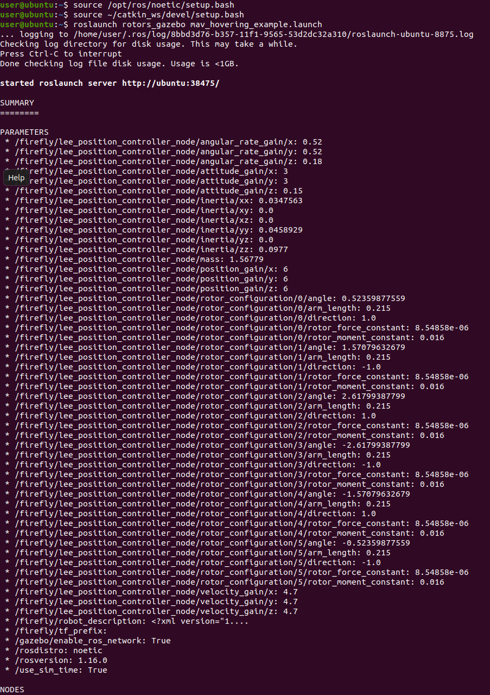
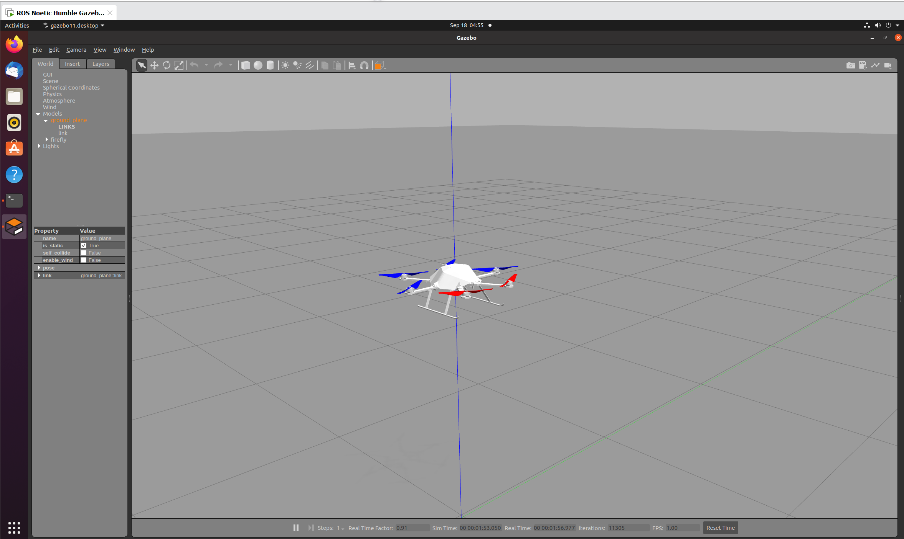

# ROS Noetic `rotors_gazebo` 无人机仿真记录

## 1. 实验概述

本实验在 Ubuntu 虚拟机中使用 ROS Noetic、Gazebo 11 和 Catkin 工作空间，启动 `rotors_gazebo` 的 Firefly 多旋翼悬停示例，验证无人机模型、Gazebo 物理仿真和 ROS 节点是否能够正常运行。

实验最终成功打开 Gazebo，并在场景中看到 Firefly 无人机模型。Gazebo 底部显示仿真时间持续增加，说明物理仿真正在运行。

## 2. 环境信息

- ROS 发行版：ROS Noetic（ROS1）
- 仿真器：Gazebo 11.13
- 工作空间：`~/catkin_ws`
- 目标功能包：`rotors_gazebo`
- 使用的启动文件：`mav_hovering_example.launch`

## 3. 启动步骤

在终端中加载系统 ROS 和当前工作空间环境：

```bash
source /opt/ros/noetic/setup.bash
source ~/catkin_ws/devel/setup.bash
```

然后启动悬停示例：

```bash
roslaunch rotors_gazebo mav_hovering_example.launch
```

ROS1 中 `roslaunch` 会自动启动 ROS Master，因此不需要事先单独执行 `roscore`。

启动后，`roslaunch` 会读取 `.launch` 文件中的参数，启动 Gazebo、无人机模型、控制器以及相关传感器节点。终端输出中的 `PARAMETERS` 部分显示了控制器参数，例如位置环增益、姿态环增益、速度环增益、无人机质量和旋翼配置等。

## 4. 运行结果

### 4.1 启动终端



终端中可以观察到以下关键信息：

- 已启动 `roslaunch server`，说明启动服务正常运行；
- `rosdistro: noetic`，确认使用的是 ROS Noetic；
- 参数命名空间为 `/firefly/...`，说明当前示例使用的是 Firefly 无人机模型；
- 控制器参数已经被加载，例如 `position_gain`、`velocity_gain` 和 `attitude_gain`；
- 日志被写入 `~/.ros/log/`，便于后续排查问题。

### 4.2 Gazebo 场景



Gazebo 窗口中可以看到：

- 地面平面 `ground_plane`；
- Firefly 六旋翼无人机模型；
- 模型已经出现在世界坐标系附近；
- 底部 `Sim Time` 持续变化，`Real Time Factor` 接近 1，说明仿真基本能够实时运行。

## 5. 结果分析

本次实验达到了预期目标：

1. ROS Noetic 环境变量加载成功；
2. `rotors_gazebo` 功能包能够被 `roslaunch` 找到；
3. Gazebo 成功启动并加载 Firefly 模型；
4. 无人机控制器和仿真参数成功加载；
5. 仿真时间在推进，说明 Gazebo 物理引擎没有停滞。

需要注意，启动窗口中显示的是“悬停示例”的初始仿真场景。无人机是否会自动起飞、保持高度或执行轨迹，取决于启动文件中加载的控制器和命令发布节点。若要进一步控制无人机，可以继续观察 ROS 话题，或使用键盘、手柄和航点发布器对应的启动文件。

## 6. 常用检查命令

启动仿真后，可以在另一个终端加载相同环境：

```bash
source /opt/ros/noetic/setup.bash
source ~/catkin_ws/devel/setup.bash
```

查看当前运行的节点：

```bash
rosnode list
```

查看当前话题：

```bash
rostopic list
```

查看某个话题的实时消息，例如：

```bash
rostopic echo /firefly/odometry_sensor1/odometry
```

查看节点和话题的图形关系：

```bash
rqt_graph
```

停止仿真时，在启动 `roslaunch` 的终端按下：

```text
Ctrl + C
```

## 7. 编译问题说明

工作空间中还包含其他机器人和示例功能包。完整执行 `catkin_make` 时，曾遇到 `mw_vision_example` 依赖 `turtlebot3_gazebo`，而系统安装的是 `sdformat-9.10`、配置文件要求 `sdformat-9.8` 的版本不匹配问题。

该问题与本次 `rotors_gazebo` Firefly 仿真不是同一条依赖链。因此，针对无人机仿真应优先使用目标包及其依赖进行编译，例如：

```bash
cd ~/catkin_ws
source /opt/ros/noetic/setup.bash
catkin_make --only-pkg-with-deps rotors_gazebo
source ~/catkin_ws/devel/setup.bash
```

这样可以避免让不相关的 TurtleBot3 示例阻塞无人机仿真环境。

## 8. 结论

本实验验证了 ROS Noetic 下 `rotors_gazebo` 的基本运行环境。通过 `mav_hovering_example.launch`，Gazebo 成功加载 Firefly 六旋翼无人机并开始物理仿真，说明工作空间、ROS 环境、无人机模型和 Gazebo 之间的连接是正常的。

后续可以基于该环境继续进行：

- `/firefly` 话题和节点分析；
- 键盘控制无人机；
- 航点发布与轨迹跟踪；
- 视觉惯性传感器仿真；
- 多无人机编队仿真。
